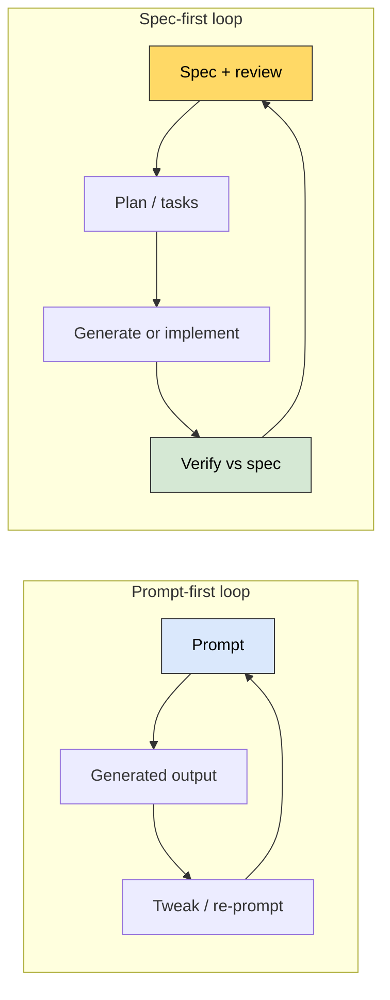

# Prompt-first speed versus spec discipline

I'm sorting out two different ways AI shows up in how I build things. One path optimizes for
**velocity**: I state what I want in natural language, iterate on the output, and the conversation
starts to double as an informal spec. The other path optimizes for **durability**: I nail down intent in
an explicit, reviewable specification and treat generated code as something that must match that
intent.

Both are legitimate; the mistake I'm trying to avoid is using the fast path **by default** when the
stakes are high, then wondering why maintenance hurts.

## Two loops side by side

Loop A is great for discovery. Loop B is what I want when I need **predictable reproduction** later
(see `docs/02_project-playbook.md`).

## When prompt-first is enough

I'm comfortable staying fast when:

- The cost of a wrong answer is **low** (throwaway script, personal spike).
- I'm **time-boxing** exploration and will not ship the result as-is.
- I can **name** what I learned and either delete the artifact or promote it into a real spec.

## Why the fast path stops scaling

When something has to last, the same habits create risk. I'm learning to name failure modes so I'm
not surprised later:

| Failure mode | What goes wrong | Early warning sign |
|--------------|-----------------|-------------------|
| Hidden assumptions | Vague prompts get interpreted; edge cases I never stated get filled in. | Surprises in demo or review. |
| Context loss | Decisions from last week do not live in the model's head; the patchwork grows. | Inconsistent patterns across files. |
| Fit to my system | Generic solutions ignore how *this* repo is structured and named. | Glue code and renames pile up. |
| Weak traceability | "Why is it like this?" is hard to answer if the only artifact is the latest code. | Onboarding or audit pain. |

None of this means I should stop using AI. It means I need **different guardrails** when stakes go up.

## What I'm taking from spec-first thinking

I'm experimenting with treating the **specification**—not the generated snippet—as the thing that gets
versioned, discussed, and approved. The model's job, in that picture, is to implement or revise code
**against** that blueprint.

Practices I want to try consistently:

- Keep specs where I review them (`src/specs/` in this repo for learning work; same habit in project
  repos).
- Resolve ambiguity *before* I ask for a big generation step, instead of hoping the model asks me.
- Slice work into pieces I can test or verify independently.
- Hold back full auto-generation until I've actually agreed with the plan.
- Decide early what "done" means in terms of **checks**, not just a working demo.

## Questions I ask before I choose a path

- If I'm hit by a bus tomorrow, could someone else ship the **same behavior** from what I wrote down?
- Is there **money, data, or reputation** on the line if this is wrong?
- Will I **revisit** this area in three months? If yes, a spec pays rent.

## Reframing my role

I'm trying to spend more attention on **clarifying intent**—constraints, edge cases, security
expectations—and less on pretending that speed alone is progress. AI still feels like a multiplier; the
open question for me is whether I'm multiplying **clear intent** or multiplying **guesses**.

### Next experiment for me

Pick one small feature, write a **half-page spec** with three acceptance bullets, then prompt. Compare
how much rework I avoid versus my usual prompt-only start.
