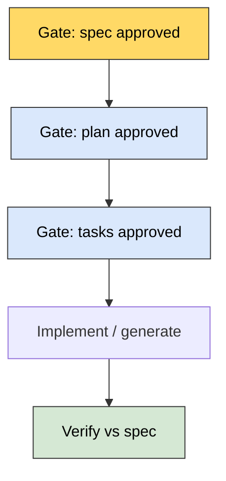

# Specs as the contract for AI-assisted building

I'm learning to treat **clarity of intent** as the main bottleneck when an agent can emit code quickly.
If I describe behavior loosely, I still get an answer—just not necessarily the one I needed. The
**specification** is the interface where I reduce guesswork: same role a clear ticket has for a human, but
with less room for the model to "read my mind."

## Why scattered docs failed me before

Wikis, PDFs, and ad hoc notes **drift** from the running system. I fell into a mode where **only the
repo felt trustworthy**, which threw away the **why** behind changes.

I'm experimenting with keeping intent **versioned next to code**—same review habits, same PR flow—so
updating behavior and updating intent are **one habit**, not two.

## What "executable intent" means to me

**Executable** does not always mean the spec is literally code. It means the spec is **complete enough**
to drive the **next** artifacts without me improvising mid-flight:

- Plans and task breakdowns
- Prompts or tool policies
- Tests or eval scripts

If I omit **scope**, **user journeys**, **acceptance criteria**, **data contracts**, **non-functionals**,
or **integration seams**, I'm effectively asking the agent to **invent** them—and it will.

## Dimensions I try to cover (checklist for myself)

| Dimension | Question I answer in the spec |
|-----------|------------------------------|
| Scope | What is in / out for this slice? |
| Actors & flows | Who does what, in what order? |
| Data | Shapes, validation, retention, PII? |
| Failure | Timeouts, retries, user-visible errors? |
| Non-functional | Latency, cost, rate limits, accessibility? |
| Security | AuthZ, secrets, abuse cases? |

I do not need a novel every time; I need **no silent blanks** on dimensions that matter for *this*
change.

## Ambiguity as debt

Models tend to **complete** the picture instead of pausing. I'm training myself to **surface unknowns on
purpose**: open questions, unclear SLAs, localization, edge cases—tagged so they become **tracked work**
instead of silent guesses baked into generated output.

If I cannot tag an ambiguity, I probably have not understood the problem yet; generating code early would
be theater.

## Gates I'm considering

Fast wrong code is still wrong code. I want **human checkpoints** where leverage is high:

1. **Spec** — Does the behavior story match what we want?
2. **Technical plan** — Approach, risks, touchpoints.
3. **Tasks** — Sized so each piece is verifiable.
4. **Implementation** — After the above pass, not instead of them.

Each gate is a chance to catch **direction** errors before they multiply. Skipping gates is a conscious
risk call, not an accident.

## Project constitution

I'm drawn to a single, repo-local **rule file** (often Markdown) that states non-negotiables: logging,
testing expectations, architectural boundaries, banned patterns. That gives agents **guardrails**
without specifying every line. I treat it as the **defaults** layer; the spec is the **feature** layer.

## How this ties to my playbook

When I start a real project, I want **spec + eval** defined before I pretend the hard thinking is over—see
`docs/02_project-playbook.md` steps 2–3. This note is the **why** behind those steps when AI is in the
loop.

## The question I'm carrying

If intent is the long-lived artifact and code is more disposable, **how well does my documentation
actually "compile"?**—can another person or agent go from spec to correct behavior **without** mind
reading?

When the answer is "not well enough," my next move is to **tighten the spec**, not to blame the tool.
